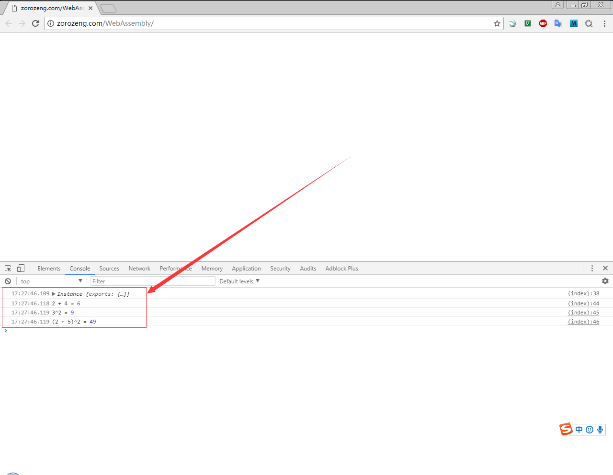

# WebAssembly Emscripten

[Example](http://zorozeng.com/WebAssembly/)

**使用Chrome，按F12查看效果**

## 参考文档

* [如何评论浏览器最新的 WebAssembly 字节码技术？](https://www.zhihu.com/question/31415286)
* [让C代码在浏览器中运行——WebAssembly入门介绍](http://blog.csdn.net/sinat_32582203/article/details/73355211)
* [WebAssembly 实践：如何写代码](https://segmentfault.com/a/1190000008402872)
* [Emscripten](http://kripken.github.io/emscripten-site/)

## Online 编译工具

[WebAssembly Explorer](https://mbebenita.github.io/WasmExplorer/)

## 操作流程

拷贝[test.html](test.html)、[test.wasm](test.wasm)到Web Server里，在浏览器中按F12，Console中可以看到数据。

